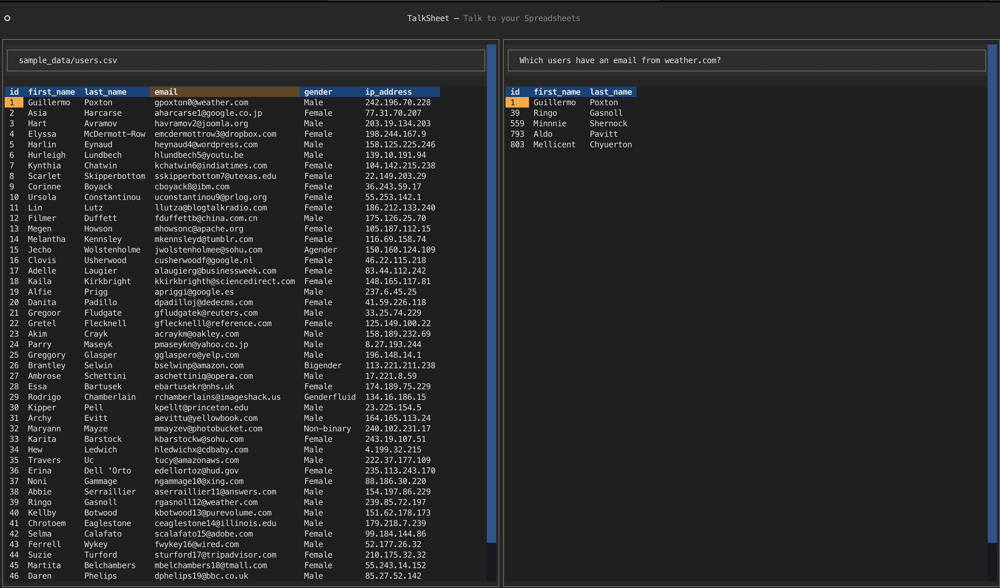
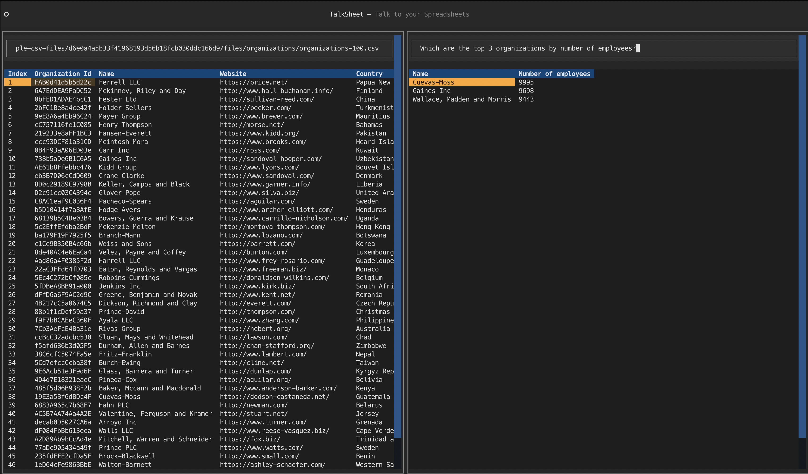

# Talksheet

Talksheet is an AI-powered CLI tool for exploring data. Powered
by [Langchain](https://langchain.com/) & [DuckDB](https://duckdb.org/).

Currently, it can read data from local CSV files:



And from remote CSV files, such as those hosted on GitHub,
like [this one](https://media.githubusercontent.com/media/datablist/sample-csv-files/d6e0a4a5b33f41968193d56b18fcb030ddc166d9/files/organizations/organizations-100.csv)



## Installation

Talksheet is available on PyPI. You can install it with pip:

```bash
pip install talksheet
```

Developed and tested with Python 3.10

## Usage

Talksheet is a CLI tool. You can run it with the `talksheet` command.

```bash
export OPENAI_API_KEY=<your_openai_api_key>

talksheet
```

## Roadmap

- Better UI/UX
- Handle more data formats
- Customize CSV format
- Export results
- Startup with a specific file
- Configure OpenAI API key in the UI
- Save chat history
